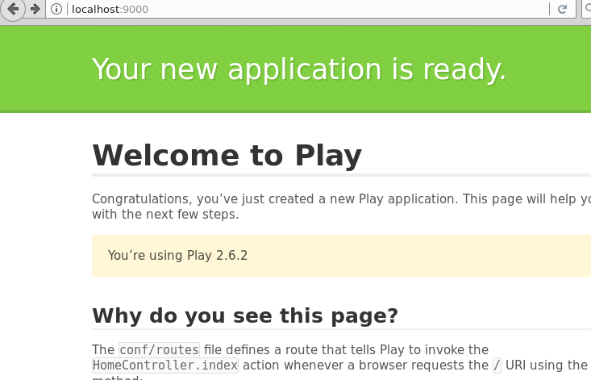

[](https://travis-ci.org/playframework/play-java-starter-example)

# play-java-starter-example

This is a starter application that shows how Play works.  Please see the documentation at https://www.playframework.com/documentation/latest/Home for more details.

## Build and Run

### Build with a local Java SDK

> Note: you will need a working JAVA environment on your system to proceed:

Build and run this application using [sbt](http://www.scala-sbt.org/).  If you downloaded this project from http://www.playframework.com/download then you'll find a prepackaged version of sbt in the project directory:

```
$ sbt compile
$ sbt run
```

### Build with Docker

> Note: you will need [Docker CE](https://www.docker.com/community-edition#/download) installed on your system to proceed.

Build and run this application using Docker:

```
$ docker build -t playframework/play-java-starter-example .
$ docker run -ti --rm -p 9000:9000 \
    playframework/play-java-starter-example
```

### Test the application

Once built and running you can view the application by going to http://localhost:9000 in your web browser of choice.

> Note: if you are using docker-machine or docker in a VM you may have a different hostname based on `$DOCKER_HOST` to use here instead.



## Further Reading

### Controllers

There are several demonstration files available in this template.

- HomeController.java:

  Shows how to handle simple HTTP requests.

- AsyncController.java:

  Shows how to do asynchronous programming when handling a request.

- CountController.java:

  Shows how to inject a component into a controller and use the component when
  handling requests.

### Components

- Module.java:

  Shows how to use Guice to bind all the components needed by your application.

- Counter.java:

  An example of a component that contains state, in this case a simple counter.

- ApplicationTimer.java:

  An example of a component that starts when the application starts and stops
  when the application stops.

### Filters

- ExampleFilter.java

  A simple filter that adds a header to every response.
